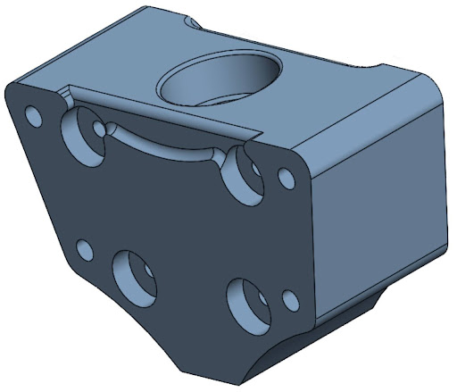

---







## Goals
- Designed and fabricated a turbine system to pull a 1 newton weight at least 20 feet using 1 liter of water
- Designed using constraints on turbine wheel size, reservoir height, and tubing size

---

## How?
- Performed hand calculations and EES calculations to size components
- Modeled and fabricated turbine system and structure using SolidWorks, FDM 3D printing, and shop tools

3D Printed Runner


3D Printed Nozzle


This is where your text goes. Because the image is set to "float: left", this paragraph will automatically rise up and wrap neatly around the right side of the nozzle image. You can write as much text here as you need, and it will fill the empty space next to the picture.

---



## Results
- Conducted multiple rounds of testing and revisions to optimize the turbine performance and pulling speed in competition
- Successfully pulled 1 newton weight 20 feet

 
